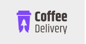
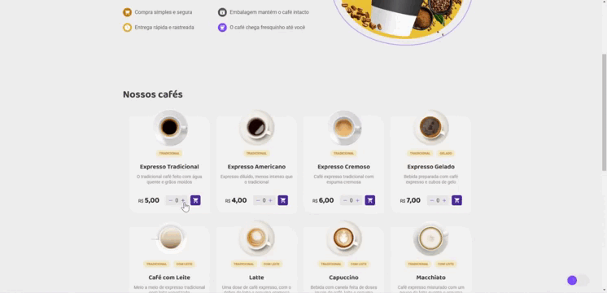

<h1 align="center">
    
  <br/>
    Coffee Delivery
</h1>

<p align="center">
 <a href="#-sobre-o-projeto">Sobre</a> •
 <a href="#-layout">Layout</a> • 
 <a href="#-tecnologias-utilizadas">Tecnologias</a> • 
 <a href="#-instalação-e-uso">Instalação</a> • 
</p>

## 💻 Sobre o projeto

  Os principais objetivos desta aplicação foi treinar a utilização das seguintes ferramentas/tecnologias: 
  - Lidar com datas e horarios através da biblioteca `date-fns`
  - Utilização de formulários com `React Hook Form`
  - Aplicação de temas dark e light utilizando o `Styled Components`
  - Uso do hook `useReducer` do React para centralizar as alterações em um estado complexo
  - Outros...

## 🎨 Layout
<p align="center">
  
</p>


## 🚀 Tecnologias

Esse projeto foi desenvolvido com as seguintes tecnologias:

✔ [Vite](https://vitejs.dev/)
<br/>
✔ [ReactJS](https://reactjs.org/)
<br/>
✔ [TypeScript](https://www.typescriptlang.org/)
<br/>
✔ [Styled Components](https://styled-components.com/docs)
<br/>
✔ [Phosphor Icons](https://phosphoricons.com/)
<br/>
✔ [date-fns](https://date-fns.org/docs/Getting-Started)
<br/>
✔ [React Hook Form](https://react-hook-form.com/)
<br/>
✔ [Zod](https://github.com/colinhacks/zod)
<br/>
✔ [React Router](https://reactrouter.com/en/v6.3.0/getting-started/overview)
<br/>
✔ [Immer](https://github.com/immerjs/immer)
<br/>


## 🚀 Instalação e uso

```bash
# Clone o repositório
git clone https://github.com/gabriel-assana/coffee-delivery.git

# Acesse a pasta do projeto
cd coffee-delivery

# Instale as dependências
npm install

# Execute a aplicação
npm run dev

# O servidor inciará na porta:3000 - acesse http://localhost:3000
```
